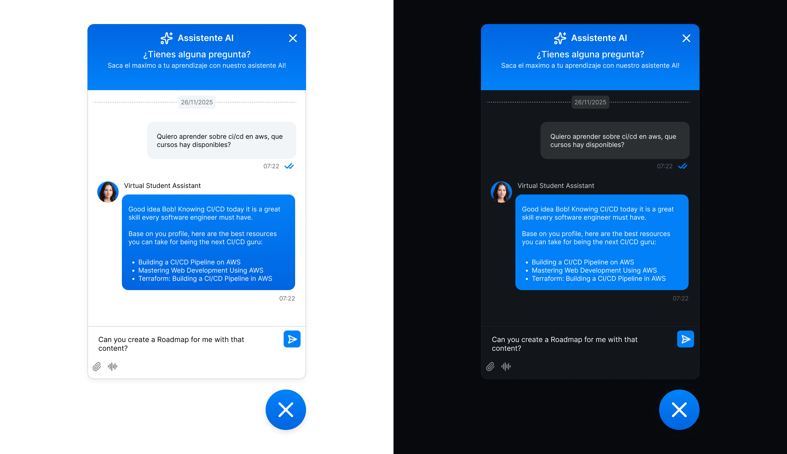

# Chatbox-ui

A simple minimalistic and light chatbot ui that can connect with any API via a set of expose contracts. It is built with vanilla ts, and use the directly the dom so it's fast and light.

## Design (Figma)

[DesignFigma](https://www.figma.com/design/4OHwdAGAQHZio2JvVecSPZ/JoseAburtoChatbot?node-id=0-1&t=JeGFcJqTdotkRDFP-1)